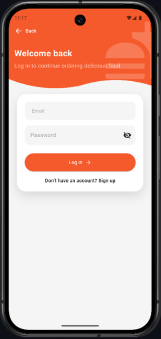
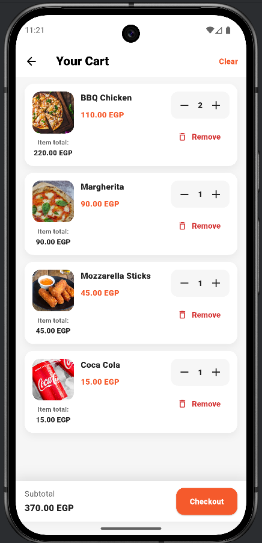
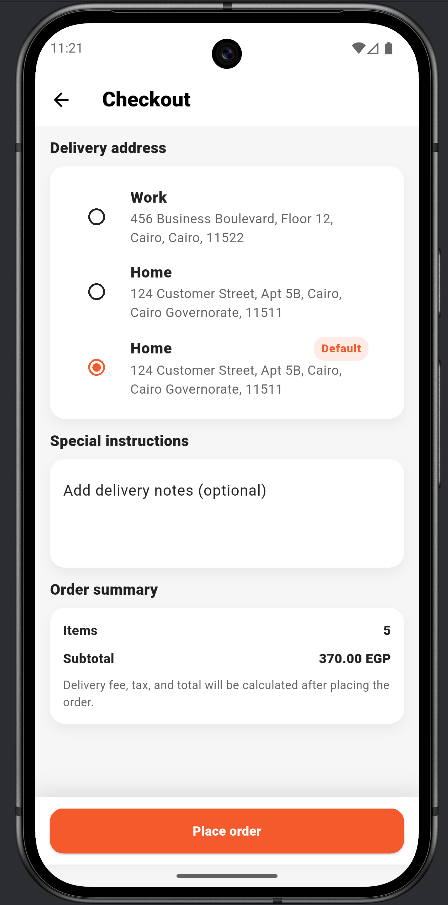
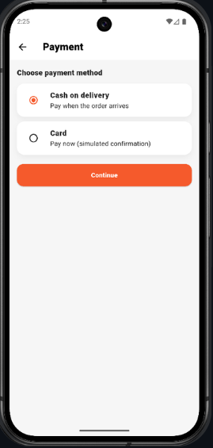
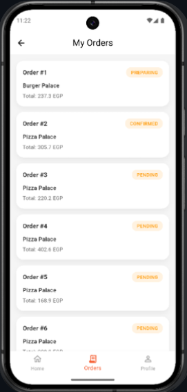
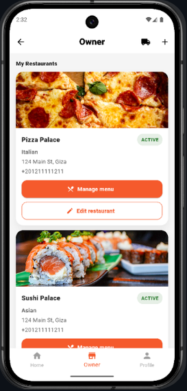
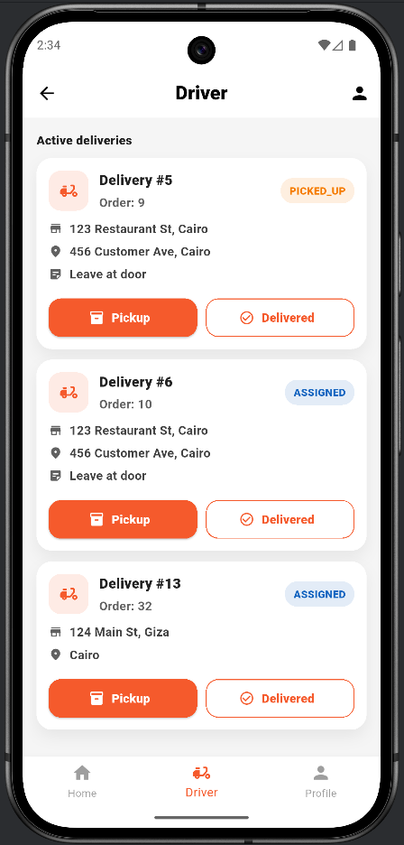
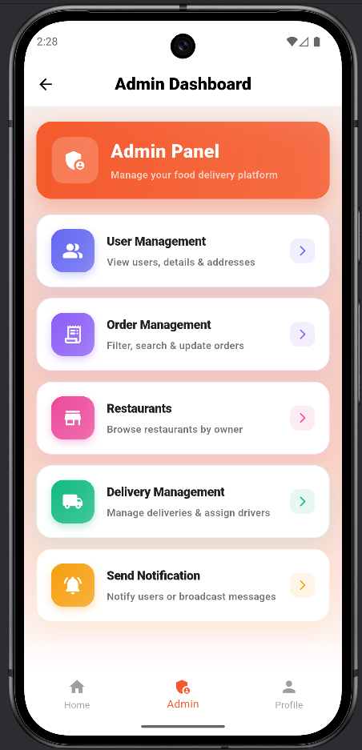
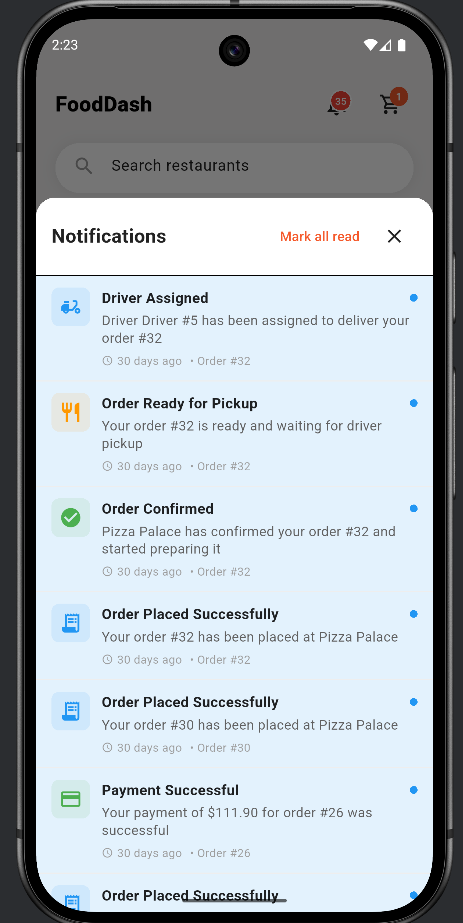

# 🍔 FoodDash – Distributed Food Delivery Platform

FoodDash is a **microservices-based food delivery application** inspired by platforms like Talabat.  
It is designed to demonstrate **distributed systems architecture**, **role-based access control**, and **end-to-end mobile–backend integration** using modern backend and mobile technologies.

The system supports multiple user roles — **Customer, Restaurant Owner, Delivery Driver, and Admin** — each with distinct permissions and workflows.

---

## 🧩 System Overview

FoodDash follows a **microservices architecture** with centralized routing, service discovery, and asynchronous communication where needed.

### Supported Roles
- **Customer**: Browse restaurants, manage cart, place orders, and pay
- **Restaurant Owner**: Manage their restaurants, orders and update order status
- **Delivery Driver**: View assigned orders and handle delivery
- **Admin**: System-level order and user management

Each role accesses a **different UI flow** in the mobile application, enforced by backend authorization.

---

## 🏗 Architecture

- **API Gateway** for centralized routing and security
- **Service Discovery** using Netflix Eureka
- **JWT Authentication** with **role-based authorization enforced at the gateway**
- **RESTful communication** between services
- **RabbitMQ** for asynchronous **notification handling**
- **Database per service** for loose coupling and scalability

---

## 📸 Screenshots

### 🚀 App Entry
<p float="left">
  
  
  
</p>

---

### 🧑‍🍳 Customer Experience
<p float="left">
  
  
  
  
</p>

---

### 📦 Order Lifecycle
<p float="left">
  
  
  
  
</p>

---

### 🚚 Restaurant Owner & Delivery Driver
<p float="left">
  
  
  
</p>

---

### 🛠 Admin & Operations
<p float="left">
  
  
  
  
  
  
  
</p>

---

### 🔔 Event-Driven Notifications
<p float="left">
  
</p>

---


## 🔧 Backend Services

All backend services are built using **Java + Spring Boot**, each with its own MySQL database.

| Service Name | Responsibility |
|-------------|----------------|
| auth-service | Authentication, JWT generation, role validation |
| gateway-service | API Gateway, request routing, authorization |
| eureka-server | Service discovery |
| cart-service | Cart management |
| order-service | Order creation and lifecycle |
| payment-service | Payment handling |
| delivery-service | Driver assignment and delivery flow |
| notification-service | Asynchronous notifications (RabbitMQ) |

---

## 📱 Frontend (Mobile Application)

- **Framework**: Flutter
- **Platforms**: Android / iOS
- **Features**:
  - Role-based UI rendering
  - Secure API communication via JWT
  - Restaurant & menu browsing
  - Cart management and checkout
  - Order tracking across lifecycle
  - Separate dashboards per role (Customer / Owner / Driver / Admin)

The mobile app communicates exclusively through the **API Gateway**, ensuring consistent security and routing.

---

## 🔐 Security

- **JWT-based authentication**
- **Role-based authorization**
- Authorization logic enforced at the **API Gateway level**
- Clear separation of permissions per role

---

## 📦 Messaging (RabbitMQ)

RabbitMQ is used to enable **asynchronous communication**, primarily for:
- Notification handling
- Decoupling notification logic from core order flow

This improves scalability and responsiveness.

---

## 🗄 Databases

- **MySQL**
- **One database per service**
- No shared databases (service isolation maintained)

---

## 🐳 Docker & Tooling

- Docker used for service containerization (partially)
- Postman collections used for API testing and validation
- Services can be run independently or as part of the system

---

## 📁 Repository Structure

```text
backend/
 ├── auth-service
 ├── cart-service
 ├── delivery-service
 ├── eureka-server
 ├── gateway-service
 ├── notification-service
 ├── order-service
 └── payment-service

frontend/
 └── fooddash_flutter_app
```

## 🚀 How the System Works (High-Level Flow)

1. User authenticates and receives a **JWT** from the `auth-service`
2. All client requests are routed through the **API Gateway**
3. Customer browses available restaurants and their menus
4. Selected items are added to the cart
5. Order is placed and **payment is processed**
6. Order status is updated by the **restaurant owner or admin**
7. A delivery driver is assigned and completes the delivery
8. Notifications are sent **asynchronously** using RabbitMQ

---

## 🎯 Project Focus

**FoodDash** is designed and implemented using **real-world distributed systems principles**, including:

- Service decomposition
- API Gateway pattern
- Service discovery
- Event-driven communication
- Secure role-based access control
- Mobile–backend integration

---

## 🛠 Technologies Used

- **Backend**: Java, Spring Boot, Spring Cloud
- **Service Discovery**: Eureka
- **API Gateway**: Spring Cloud Gateway
- **Messaging**: RabbitMQ
- **Database**: MySQL
- **Frontend**: Flutter
- **Containerization**: Docker
- **Testing**: Postman

---

## 📌 Notes

This project focuses on **architecture, scalability, and system design** rather than UI polish.  
It is intended to showcase **backend engineering and distributed systems skills**.


